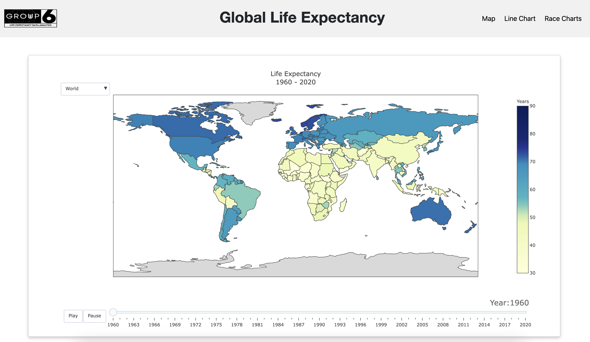
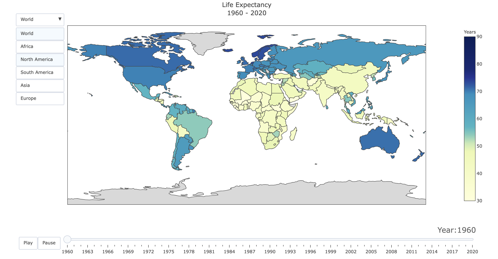
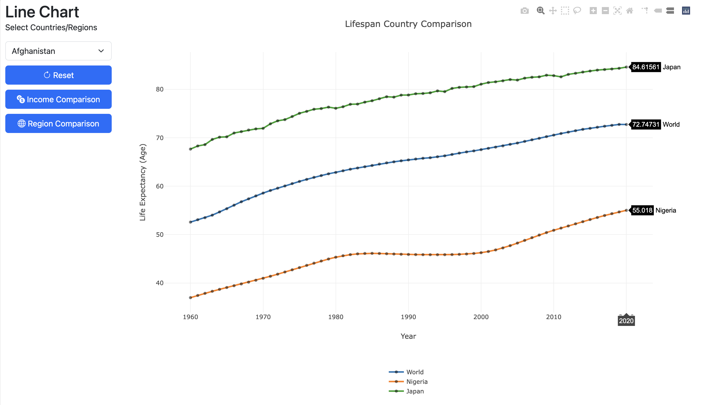
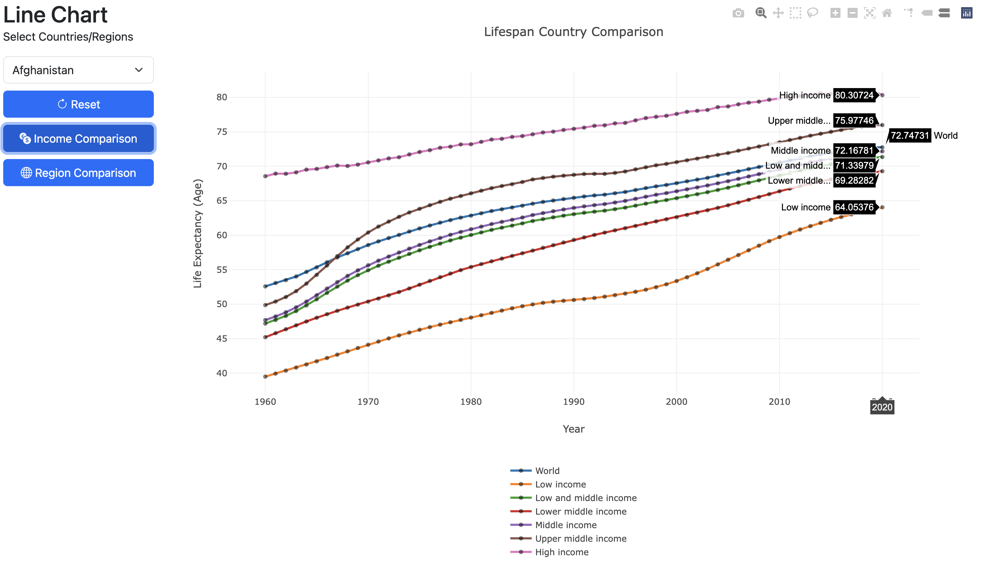
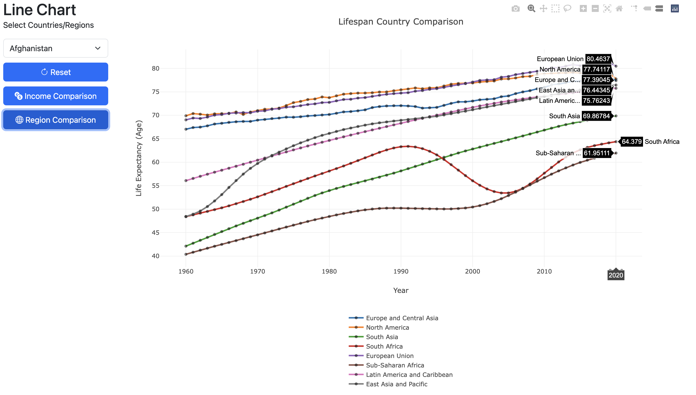
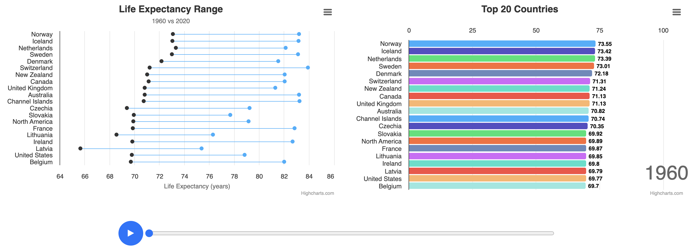

# Global Life Expectancy: 1960 to 2020
### Description
A basic data visualization dashboard of global life expectancy and the changes that have occurred from 1960 to 2020. The source of the data is from Our World in Data: [source](https://ourworldindata.org/grapher/life-expectancy-at-birth-total-years)

### Info / Credits
- Analysis by
* `Jennifer Alfson` [@jennyalfi](https://github.com/jennyalfi)
* `Niti Patel` [@niti2442](https://github.com/niti2442)
* `Gagandeep Singh` [@gsingh510](https://github.com/gsingh510)
* `Kolton Xie` [@kottonxie](https://github.com/kottonxie)
* `Alex Storton` [@astorton](https://github.com/astorton)
* `Bryan Tsan-Tang` [@bryan-tt](https://github.com/bryan-tt)

   - `REPO:` https://github.com/bryan-tt/global_life_expectancy

   - `Analysis Last Updated:` June 27th, 2023

   - `Report Last Updated:` June 27th, 2023

### Data Sources
|Name|Type|Description|Website|
|---|---|---|---|
|Life Expectancy 1960-2020 | CSV | The average number of years a newborn would live if age-specific mortality rates in the current year were to stay the same throughout its life. |https://ourworldindata.org/grapher/life-expectancy-at-birth-total-years|

## Table of Contents
- Introduction
- About the Data
- Backend Setup
- Front End Visuals
   * Map
   * Line Chart
   * Bar Race and Dumb Bell Chart
- Challenges & Future Plans
- Conclusion

## Introduction
Greetings!

If you are interested in gathering insights on life expectancy and its correlations with income at the global level then you’ve come to the right place! The purpose of this repository is to store all relevant data and scripting that enable the user to fire up an interactive dashboard to gain said insights. All tools and resources were produced for Project 3 of the 2023 Data Analytics Bootcamp at UC, Berkeley and authored by the following team members:

- Jennifer
- Niti
- Gagandeep
- Kolton
- Alex
- Bryan 

In this dashboard project, we utilized the knowledge we obtained on Python, PostgreSQL, Plotly.js, D3.js, Highcharts.js, Javascript, HTML, CSS, and accessing APIs to create the dashboard tool to visualize global life expectancy data.

## About the Data
Our data visualization dashboard was created using Our World in Data with varying data points such as countries, regions, and income. The purpose of the data was to see the life expectancy on a global scale.

The dataset provides a series of macro-level data points specific to entities (such as countries, incomes, and regions), the year, and the average life expectancy. All data collected was dated from the year 1960 to 2020.

## Backend Setup
Backend is defined as the data schema, storage and automated query and prep for the visualizations. Data storage was made possible utilizing a DBBeaver PostgresSQL Database; following a simple, single table schema with 4 native data fields and one custom primary key generated by the team itself. Data fields identified below.  

- primary key (integer)
- entity (varchar)
- code (varchar)
- year (integer)
- life_expectancy (float)

The PostGresSQL database is directly connected with a Flask Server that automates the data query via a single route API. Flask processes to make the data usable for the JS/HTML powered visualizations contained in the dashboard. A key element is the existence of the Primary Key our team generated. This enables The SQLAlchemy ORM the ability to perform basic DDL functions (i.e. INSERT and DELETE) via the identity.map session functionality inherent in the app.

## Front End (Visuals)

### Map
The choropleth map visual is a great way to visualize global life expectancy data per country. The main interactive features include a drop down menu to only show specific regions, mouse hover capabilities to see more detail per country, and a play/pause button with slider to see how life expectancy changes over the years.

Using this visual, we can gain insight into countries that exhibited slower progress in increasing life expectancy, enabling us to explore factors like lower GDP, limited healthcare access, water quality, literacy rate, and more in our search for possible explanations.

### Line Chart
##### Lifespan Country Comparison
We created a line chart visual using JavaScript Plotly with a dropdown menu for the user to select what they’d like to compare. Selectable options include:
- Country
- Income Level
- Region
- Reset Button
The landing page includes a line chart comparing Japan (longer average life expectancy), Nigeria (shorter average life expectancy), and the World average life expectancy. The user can then select additional options to compare from the dropdown menu or click the reset button and select only what they want to compare. 

To see more details, the user can hover over the line, and the average life expectancy and the year will pop up.

##### Income Comparison
We created an income comparison button that shows the data for the following world income levels: low, lower middle, low & middle, middle, upper middle, and high.
- This reveals that income level directly impacts the lifespan of its people, as seen below.

##### Region Comparison
We created a region comparison button that shows the data for the world regions: European Union, North America, Europe and Central Asia, East Asia, Latin America, South Asia, South Africa, and Sub-Saharan Africa.

- This demonstrates the overall region’s life expectancy, as seen below.

### Bar Race and Dumb Bell Chart
Using the bar race graph with a sorting function helped us to visualize the top 20 countries with the highest life expectancies per year. This helped us see which countries were doing the best per year, and the added play button functionality let us see how this changed from year to year. 

The bar race graph helped us see the top 20 life expectancies and the countries, but the dumb bell chart allowed for us to see the full range in how much a country’s life expectancy has grown over the period 1960 to 2020. Pairing these two charts together gave us a clear picture on life expectancy growth. 

## Challenges & Future Plans
Visualization Tools:
Some of the main issues we had revolved around using new visualization tools. We attempted to use the highcharts.js library to create the map, however this proved to be a little too complex to learn. With our time constraint we decided to use a more familiar library Plotly.
We initially created our map visual with plotly.py (python), but the challenge we faced was incorporating the python visual into our html page. Because we were unfamiliar with PyScript, we ended up switching to plotly.js (javascript). 
The last challenge we faced was trying to incorporate other types of charts, but most did not match the data we were using (tree map).

Future Plans:
For future plans and what if’s, we would have liked to put some more time into styling our dashboard to have a theme. We would have also liked to incorporate more data to try and find explanations to the life expectancy numbers. The data that could potentially explain this would be GDP, literacy rate, access to healthcare, or water quality. The last future plan would be to try and incorporate live data, so we can get real time updates on the dashboard.

## Conclusion
Overall this dashboard project has helped us to exercise our full stack web development skills. We were able to connect a backend to a front end, and display information in a dashboard that is easily digestible and user friendly.

We learned a lot about the purpose of dashboards, and how they can provide valuable insights and information to users. The global life expectancy dashboard we have developed serves as a powerful tool for visualizing and understanding life expectancy trends across different countries and regions.

By connecting the backend to the frontend, we were able to create a seamless user experience. Users can easily interact with the dashboard, exploring different metrics and comparing life expectancies between countries. The intuitive design and user-friendly interface make it accessible to a wide range of users, from researchers and policymakers to individuals interested in global health trends.

Through the development of this dashboard, we also gained a deeper understanding of the factors that influence life expectancy. We analyzed various socio-economic indicators, such as income, to identify correlations and patterns that contribute to differences in life expectancy across countries. This knowledge can be invaluable for policymakers and organizations working to improve global health outcomes.

Furthermore, the dashboard provides a platform for users to monitor changes in life expectancy over time. By visualizing historical data and potentially incorporating real-time updates, users can track progress and identify areas where interventions and improvements are needed. This feature would enhance the dashboard's usefulness as a decision-making tool and support evidence-based policies and interventions.

Overall, the development of this global life expectancy dashboard has been a rewarding experience. It has allowed us to apply our technical skills in web development while also deepening our understanding of global health and data analysis. We hope that this dashboard will contribute to the field of public health and serve as a valuable resource for researchers, policymakers, and anyone interested in exploring and promoting global well-being.